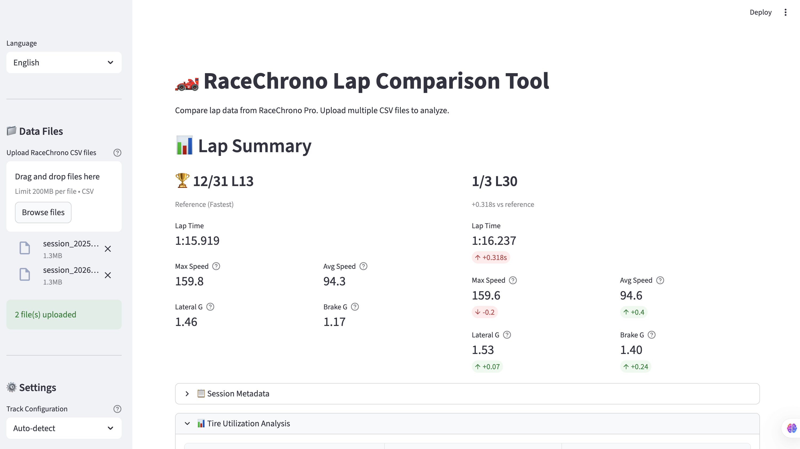
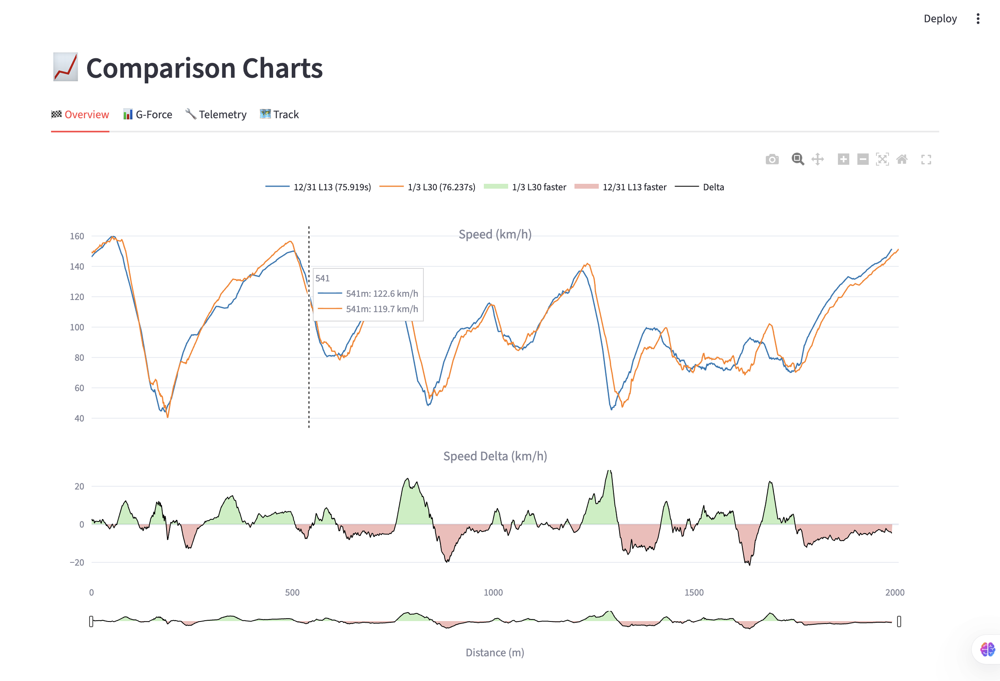
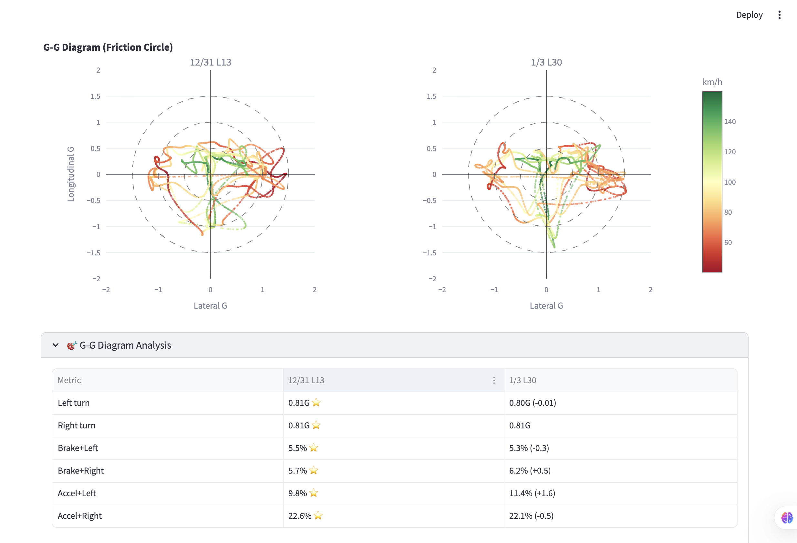
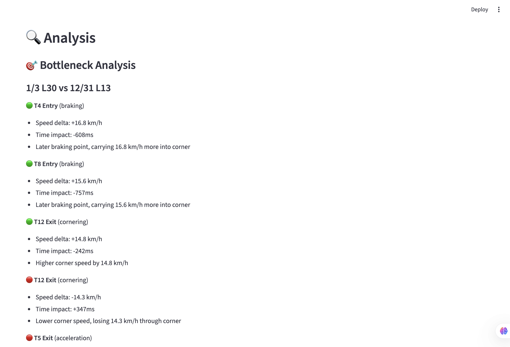

# RaceChrono Lap Analyzer

[](https://github.com/killme2008/racechrono-lap-analyzer/actions/workflows/ci.yml)
[](https://opensource.org/licenses/Apache-2.0)
[](https://www.python.org/downloads/)

A Streamlit web application for analyzing and comparing lap telemetry data exported from RaceChrono Pro.

## Screenshots

| Overview | G-Force Analysis |
|:---:|:---:|
|  |  |

| Track Map & Telemetry | Coach Insights |
|:---:|:---:|
|  |  |

## Features

- **Multi-lap comparison**: Upload multiple CSV files to compare lap times and telemetry
- **Speed analysis**: Speed vs distance charts with delta overlay
- **G-force visualization**: Lateral and longitudinal acceleration charts, G-G diagram (friction circle)
- **Track map**: GPS-based track visualization with speed coloring
- **Corner detection**: Automatic corner detection or use predefined track configurations
- **Coach insights**: Prioritized suggestions with difficulty/risk ratings for lap time improvement
- **Tire utilization analysis**: High-G percentage, trail braking stats, throttle application metrics
- **G-G diagram insights**: Left/right turn balance analysis, quadrant fill rate analysis
- **OBD support**: Throttle, brake, and RPM visualization when OBD data is available
- **Multi-language**: English and Chinese (简体中文) support

## Installation

Requires Python 3.11+ and [uv](https://docs.astral.sh/uv/).

```bash
# Clone the repository
git clone https://github.com/killme2008/racechrono-lap-analyzer.git
cd racechrono-lap-analyzer

# Install dependencies
uv sync

# Run the application
uv run racechrono-lap-analyzer
```

## Usage

1. Export lap data from RaceChrono Pro as CSV (CSV v3 format)
2. Open the web application
3. Upload one or more CSV files via the sidebar
4. Analyze the comparison charts and insights

### Exporting from RaceChrono Pro

> **Important**: This application only supports **CSV v3** format. Other CSV formats (v1, v2) are not compatible.

1. Open RaceChrono Pro
2. Select a session
3. Tap the share icon
4. Choose **Export as CSV**
5. Select **CSV v3** format (required)
6. Include channels: GPS, Accelerometer, and OBD (if available)

## Track Configuration

Track configurations in `src/racechrono_lap_analyzer/tracks/` define corner positions for accurate analysis. Currently supported:

- Shanghai Tianma Circuit (`tianma.json`)

To add a new track, create a JSON file with corner definitions (see existing files for format).

### Contributing Track Data

We welcome contributions of track configurations! To help us add support for your local track:

1. Record multiple laps with high-precision GPS (10Hz or higher recommended)
2. Export the lap data as CSV v3 format
3. Submit 3-5 clean laps from the same track via a Pull Request or Issue

With multiple high-quality GPS recordings from the same circuit, we can generate accurate track configurations including corner positions and track layout.

## Development

```bash
# Install dev dependencies
uv sync --extra dev

# Run tests
uv run pytest

# Lint
uv run ruff check .

# Type check
uv run mypy .

# Format code
uv run ruff format .
```

## Project Structure

```
racechrono-lap-analyzer/
├── src/
│   └── racechrono_lap_analyzer/
│       ├── __init__.py
│       ├── app.py           # Streamlit UI
│       ├── analysis.py      # Lap alignment, corner detection, insights
│       ├── charts.py        # Plotly chart generation
│       ├── data_parser.py   # RaceChrono CSV parsing
│       ├── i18n/            # Internationalization (en, zh-CN)
│       └── tracks/          # Track configuration files
├── tests/
│   ├── data/                # Test CSV files
│   ├── test_analysis.py
│   ├── test_charts.py
│   └── test_data_parser.py
├── pyproject.toml
├── LICENSE
└── README.md
```

## Contributing

Contributions are welcome! Please feel free to submit a Pull Request.

1. Fork the repository
2. Create your feature branch (`git checkout -b feature/amazing-feature`)
3. Commit your changes (`git commit -m 'Add some amazing feature'`)
4. Push to the branch (`git push origin feature/amazing-feature`)
5. Open a Pull Request

## License

This project is licensed under the Apache License 2.0 - see the [LICENSE](LICENSE) file for details.

## Acknowledgments

- [RaceChrono](https://racechrono.com/) for the excellent lap timing app
- [Streamlit](https://streamlit.io/) for the web framework
- [Plotly](https://plotly.com/) for interactive charts
